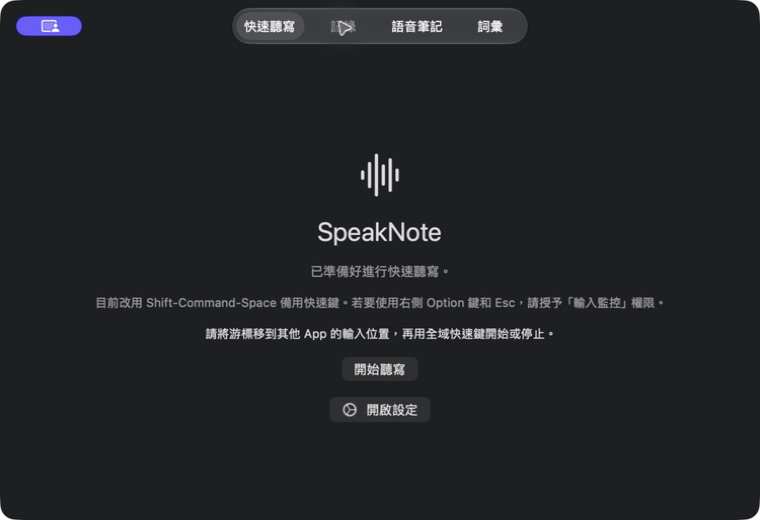

# SpeakNote

**Turn speech into ready-to-use text and structured Markdown on your Mac.**

[](https://github.com/nnnc8/SpeakNote/actions/workflows/ci.yml)
[](#compatibility)
[](LICENSE)

[Download the latest available build](https://github.com/nnnc8/SpeakNote/releases/latest) · [繁體中文](README.zh-TW.md) · [Documentation](https://nnnc8.github.io/SpeakNote/)



> **Release status:** v0.1.0 is the current source version. This repository does
> not yet claim that a signed, notarized public build has been published. If the
> Releases page has no downloadable asset, build from source or check back later.

SpeakNote is a native macOS app for quick dictation, long recordings, imported
audio, and structured notes. It can use on-device Apple Speech where available
or Groq Cloud after an explicit disclosure and user choice.

## Features

- **Quick dictation:** start from the app, menu bar, Right Option, or
  Shift-Command-Space. Menu-bar and global-shortcut starts can return text to
  the original app; the in-app button keeps the result for manual copy.
- **Safe insertion:** checks the target app, Secure Input, permission state, and
  clipboard ownership. If automatic paste is unsafe, the text remains available
  to copy manually.
- **Voice Notes:** record long sessions in recoverable segments or import M4A,
  MP3, WAV, AIFF, and CAF audio.
- **Structured Markdown:** preview class, meeting, and general notes.
  Reprocessing keeps earlier versions.
- **Language and cleanup controls:** choose recognition and output languages,
  translation, and verbatim, clean, polished, or concise output.
- **Personal vocabulary:** keep profile-specific terms and explicit replacement
  rules; suggested terms require approval before joining the active vocabulary.
- **Local history and recovery:** keep optional quick-dictation history, resume
  checkpointed work, and recover completed recording segments after interruption.

## Quick start

1. Open [Releases](https://github.com/nnnc8/SpeakNote/releases/latest). Download
   only when a release asset is present and its release notes describe signing
   and notarization status.
2. Move SpeakNote to Applications and open it.
3. Follow onboarding. Permissions are requested separately and only when you
   choose the related feature.
4. In **Settings → Provider**, choose Apple Speech or Groq Cloud. Groq features
   require your own Groq credential and acknowledgement of the cloud-processing
   disclosure.
5. Start from the menu bar or a global shortcut for guarded automatic insertion,
   or use the in-app button for a manual-copy result. Grant Input Monitoring for
   Right Option and Accessibility for automatic Command-V insertion.

## Permissions and privacy

| Permission | Why SpeakNote requests it | Without it |
|---|---|---|
| Microphone | Live dictation and Voice Note recording | Imported audio still works |
| Input Monitoring | Detect the Right Option shortcut | Use Shift-Command-Space or the app/menu-bar control |
| Accessibility | Send Command-V to the original app | Copy the result manually |
| Speech Recognition | Optional on-device Apple Speech | Use another configured provider |

SpeakNote has no analytics or advertising tracking. Its fixed-event logger does
not include audio, recognized text, prompts, provider responses, or credentials.
The Groq credential is stored in macOS Keychain; non-secret preferences use
UserDefaults; histories and Voice Note files stay in the app container until
you delete them.

Provider data flow:

- **Apple Speech:** recognition stays on this Mac when the selected language,
  model asset, OS version, and audio duration are supported.
- **Groq Cloud:** audio is sent to Groq for transcription. Text is also sent
  when cloud cleanup, translation, compression, or structured-note processing
  is selected.
- **Fallbacks:** SpeakNote does not silently cross the local/cloud boundary.
  The default policy asks before doing so, and local-only mode blocks cloud use.

Read the full [privacy notice](docs/privacy/index.md) and
[architecture overview](docs/architecture.md).

## Compatibility

- macOS 14 or later
- Apple silicon and Intel are build targets
- Apple Speech availability varies by macOS version, language, downloaded model,
  and duration; SpeakNote shows unavailable combinations instead of silently
  switching providers
- Direct distribution is the current release path. Mac App Store compatibility
  remains under evaluation because global shortcuts and cross-app insertion need
  signed, real-system validation

## FAQ

### Does SpeakNote work offline?

Apple Speech can work on-device when its capability check passes. Groq features
require a network connection.

### Does SpeakNote read text from other apps?

No. It records the original app identity, writes the result to the clipboard,
and sends Command-V when safe. It does not inspect another app's text through
the Accessibility API.

### What happens if automatic paste fails?

SpeakNote keeps the recognized result available for explicit copy. It also
avoids overwriting a clipboard that it can no longer prove it owns.

### Where are Voice Notes stored?

Inside SpeakNote's sandbox container. Imported files are copied into the app's
session storage so work can continue without depending on the original file.

### Is a signed download available now?

Do not assume so from the source version. Use the Releases page as the source of
truth; a public release should state its signing and notarization status.

## Build and test

Requirements:

- A full Xcode installation with the macOS 26 SDK or later
- [XcodeGen](https://github.com/yonaskolb/XcodeGen)

```sh
xcodegen generate
xcodebuild -project SpeakNote.xcodeproj -scheme SpeakNote \
  -destination 'platform=macOS' build test
```

The automated suite uses injected providers and local fixtures; it does not
make live Groq requests. Distribution additionally requires Developer ID
signing, notarization, and clean-Mac checks described in
[docs/release.md](docs/release.md).

## Contributing, support, and license

- Read [CONTRIBUTING.md](CONTRIBUTING.md) before opening a pull request.
- Check [SUPPORT.md](SUPPORT.md) for what to include in a useful report.
- Ask usage questions in [GitHub Discussions](https://github.com/nnnc8/SpeakNote/discussions).
- Report reproducible bugs in [GitHub Issues](https://github.com/nnnc8/SpeakNote/issues).
- Follow [SECURITY.md](SECURITY.md) for sensitive vulnerability reports.

SpeakNote is available under the [MIT License](LICENSE).
